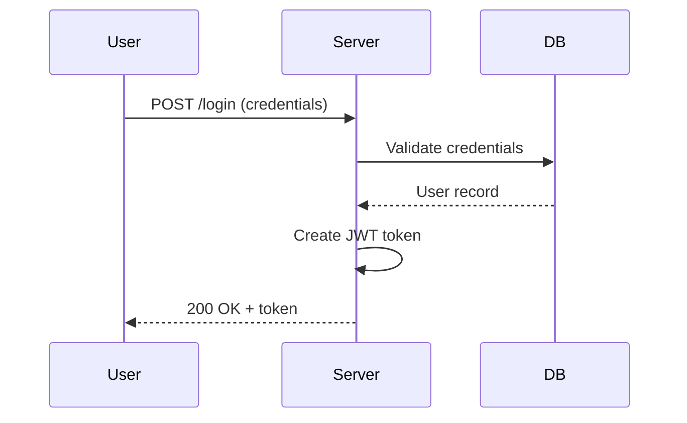

## Trigger
When the answer involves: workflows, processes, state transitions, hierarchies, dependencies, timelines, comparisons, or data flows.

## Rules
1. ALWAYS include a Mermaid diagram when the trigger conditions match
2. Choose the right diagram type:
   - Workflows/processes → flowchart
   - Request/response flows → sequence diagram
   - Lifecycle/state changes → state diagram
   - Hierarchies/dependencies → graph TD/LR
   - Timelines → gantt
   - Comparisons → use a table instead of Mermaid
3. Keep diagrams under 15 nodes. Split complex diagrams into multiple smaller ones
4. Every diagram MUST have a 1-sentence takeaway below it
5. Use descriptive node labels, not single letters (A, B, C)

## Format
```mermaid
[diagram]
```
**Takeaway:** [one sentence explaining the key insight]

## Example
User asks: "How does the login flow work?"

BAD (no visual):
> The user submits credentials, the server validates them, creates a session, and returns a token.

GOOD:

**Takeaway:** Login is a 3-hop flow (client → server → DB) with JWT token returned on success.
