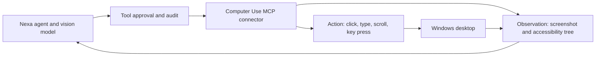

# Computer use integration

## Decision

Nexa treats computer use as a connector, not as another in-process desktop
tool. The first integration classifies `mcp__computer_use__*` and
`mcp__windows_computer_use__*` tools as the **Computer Use Connector** while
retaining the existing high-risk MCP approval policy.

This boundary lets an independently installed, platform-specific service own
screen capture, accessibility APIs, and input injection. Nexa owns the agent
loop, model selection, tool approval, audit events, cancellation, and result
handling.

## Why this shape

The Codex computer-use implementation inspected during this change follows a
useful security pattern: a separate Windows service exposes a narrow RPC
surface, observations provide scoped element identifiers, and input-producing
actions remain approval gated. Copying UI Automation or raw input injection
into the agent process would collapse that trust boundary and duplicate Nexa's
existing MCP lifecycle.

## Connector contract

An implementation should expose separate observation and action tools:

- `screenshot` and `observe` are read-only but their returned pixels and text
  remain untrusted data.
- `click`, `type`, `key`, `scroll`, and app-launching operations are mutating
  and require explicit approval according to Nexa's MCP policy.
- Element identifiers must be scoped to the observation that produced them;
  stale identifiers must fail closed.
- Every action result must report the focused window, action performed, and a
  fresh observation or an explicit observation error.
- Secrets must never be copied into screenshots, traces, or connector logs.

## Current status

The capability manifest and tool ownership route are implemented. Users can
configure a compatible MCP server without Nexa misclassifying it as a generic
connector. Shipping or silently installing a privileged Windows automation
runtime is intentionally out of scope until its package, signing, permission
prompts, and update channel can be verified.
