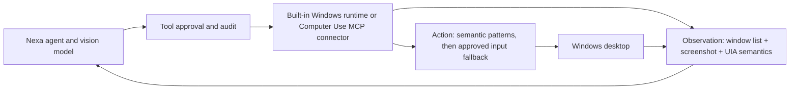

# Computer use integration

## Decision

Nexa separates browser observation from privileged desktop input. An
in-process, read-only browser-debug lane can open public and loopback local
pages. On Windows, the built-in `computer_observe` and `computer_control`
tools now provide observation-scoped window capture and approval-gated input.
Other platforms can still use a connector: `mcp__computer_use__*` and
`mcp__windows_computer_use__*` are classified as the **Computer Use
Connector** and retain the existing high-risk MCP approval policy.

The Windows implementation keeps observations and actions as separate tool
surfaces. Window pixels are captured through Windows Graphics Capture and are
ephemeral; they are forwarded only to the immediately following model step.
Windows UI Automation supplies a bounded semantic projection and
observation-scoped element IDs. Semantic `invoke` and `set_value` actions use
native accessibility patterns; pointer and keyboard fallbacks use the native
foreground input path. All actions are serialized behind Nexa's high-risk
approval boundary. A connector keeps the same split when an independently
installed platform-specific service owns capture, accessibility APIs, and
input injection.

## Why this shape

The public Codex repository exposes useful computer-use identity and approval
policy, but not a complete open-source desktop executor. Nexa's current native
backend runs Windows Graphics Capture, UI Automation, and foreground input in
the core process. This is an explicitly documented transitional boundary, not
broker isolation. The target architecture moves those privileges to a narrow
authenticated broker while keeping the v2 tool contract stable. The research
and source comparison behind that direction is in
[computer-use-landscape-2026-08-23.md](./computer-use-landscape-2026-08-23.md).

## Connector contract

Every implementation exposes separate observation and action tools:

- `screenshot` and `observe` are read-only but their returned pixels and text
  remain untrusted, potentially sensitive data. Capturing content requires a
  distinct provider-egress consent even when global tool policy says allow.
- `click`, `drag`, `type`, `key`, `scroll`, focus, and app-launching operations
  are mutating and require explicit approval according to Nexa's tool policy.
- Element identifiers must be scoped to the observation that produced them;
  observations are single-use for control and stale identifiers fail closed.
- Every action result must report the focused window, action performed, and a
  fresh observation or an explicit observation error.
- Screenshots may incidentally contain secrets and therefore require explicit
  disclosure consent, remain current-turn-only, and are removed together with
  UIA names from durable artifacts. Agents must never deliberately place
  secrets in input arguments, traces, or connector logs.

## Autonomous browser-debug loop

Interactive browser work already uses the built-in `browser_session` lane,
which owns tabs, DOM/ARIA element refs, waits, navigation, interaction,
control leases, and consequential-action approval. The loop below is the
separate deterministic, read-only diagnostics lane; it complements rather
than replaces `browser_session`.

For local web work, the main agent can now complete this loop without an
external connector:

1. `run_shell` recognizes common long-running dev servers, automatically
   promotes an accidental foreground invocation to a managed background
   service, and discovers loopback URLs from bounded startup logs.
2. `browser_evidence_capture` opens public or loopback pages in Chromium and
   returns rendered text, a screenshot, interactive-element metadata, console
   entries, JavaScript exceptions, failed requests, and HTTP 4xx/5xx responses.
3. The agent fixes the source and captures the page again until the relevant
   error is gone. The system prompt requires this observe-fix-verify cycle when
   a page is available.

Only loopback addresses are added to the browser-debug allowlist. RFC1918 LAN,
link-local, metadata-service, and other private targets remain blocked. Page
content remains untrusted data.

## Current status

Interactive `browser_session`, read-only browser observation, and local web
diagnostics are built in. Windows
now has native top-level-window enumeration, occlusion-resilient cursor-free
window capture, UI Automation semantics, optional set-of-marks overlays,
cursor observation, focus/restore, mouse move/click/drag/scroll, text entry,
bounded key sequences, semantic invoke/value actions, normalized coordinates,
and bounded wait-for-change. Non-vision models can act from the semantic
projection.

Each action consumes one observation, validates process creation time,
executable identity hash, window class/session, title, geometry, and perceptual
content before acting, protects Nexa's own process, rechecks foreground focus
before global input, and returns a fresh observation plus route, delivery, and
effect verification. Screenshot pixels, UIA names, and raw typed text remain
ephemeral; approval/UI/trace/database/provider-recovery projections summarize
sensitive arguments, remove screen-derived semantic content, and make
sensitive tool turns non-replayable. A
provider-egress approval is required for capture and cannot be bypassed by the
global allow-all mode.

The remaining architectural gap is privilege isolation: the native Windows
backend is still in-process. A future broker should enforce protected process
identities and typed actions over authenticated local IPC, own an end-to-end
killable WGC/UIA deadline, replace materializing UIA descendant queries with a
bounded RuntimeId-aware traversal and real pattern availability, and close the
mixed-DPI frame transform explicitly. Richer OCR/visual parsing should remain
an optional fallback for canvas/remote surfaces, not replace UIA or DOM
semantics.

Users can still configure a compatible MCP server for accessibility-tree
observation, richer element identifiers, app discovery, and non-Windows
platform support without Nexa misclassifying it as a generic connector.
