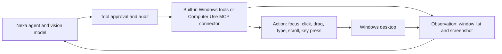

# Computer use integration

## Decision

Nexa separates browser observation from privileged desktop input. An
in-process, read-only browser-debug lane can open public and loopback local
pages. On Windows, the built-in `computer_observe` and `computer_control`
tools now provide observation-scoped window capture and approval-gated input.
Other platforms can still use a connector: `mcp__computer_use__*` and
`mcp__windows_computer_use__*` are classified as the **Computer Use
Connector** and retain the existing high-risk MCP approval policy.

The Windows implementation keeps observations and actions as separate tool
surfaces. Window pixels are captured through Windows Graphics Capture and are
ephemeral; they are forwarded only to the immediately following model step.
Mouse and keyboard input uses the native Windows input path and is serialized
behind Nexa's high-risk approval boundary. A connector keeps the same split
when an independently installed platform-specific service owns capture,
accessibility APIs, and input injection.

## Why this shape

The Codex computer-use implementation inspected during this change follows a
useful security pattern: a separate Windows service exposes a narrow RPC
surface, observations provide scoped element identifiers, and input-producing
actions remain approval gated. Copying UI Automation or raw input injection
into the agent process would collapse that trust boundary and duplicate Nexa's
existing MCP lifecycle.

## Connector contract

Every implementation exposes separate observation and action tools:

- `screenshot` and `observe` are read-only but their returned pixels and text
  remain untrusted data.
- `click`, `drag`, `type`, `key`, `scroll`, focus, and app-launching operations
  are mutating and require explicit approval according to Nexa's tool policy.
- Element identifiers must be scoped to the observation that produced them;
  stale identifiers must fail closed.
- Every action result must report the focused window, action performed, and a
  fresh observation or an explicit observation error.
- Secrets must never be copied into screenshots, traces, or connector logs.

## Autonomous browser-debug loop

For local web work, the main agent can now complete this loop without an
external connector:

1. `run_shell` recognizes common long-running dev servers, automatically
   promotes an accidental foreground invocation to a managed background
   service, and discovers loopback URLs from bounded startup logs.
2. `browser_evidence_capture` opens public or loopback pages in Chromium and
   returns rendered text, a screenshot, interactive-element metadata, console
   entries, JavaScript exceptions, failed requests, and HTTP 4xx/5xx responses.
3. The agent fixes the source and captures the page again until the relevant
   error is gone. The system prompt requires this observe-fix-verify cycle when
   a page is available.

Only loopback addresses are added to the browser-debug allowlist. RFC1918 LAN,
link-local, metadata-service, and other private targets remain blocked. Page
content remains untrusted data.

## Current status

Read-only browser observation and local web diagnostics are built in. Windows
also has native top-level-window enumeration, occlusion-resilient window
capture, cursor observation, focus, mouse move/click/drag/scroll, text entry,
and bounded key sequences. Each action requires a non-expired observation
token, revalidates the window process before input, and returns a fresh
post-action screenshot or an explicit observation error. Minimized windows
must be restored before capture.

Users can still configure a compatible MCP server for accessibility-tree
observation, richer element identifiers, app discovery, and non-Windows
platform support without Nexa misclassifying it as a generic connector.
