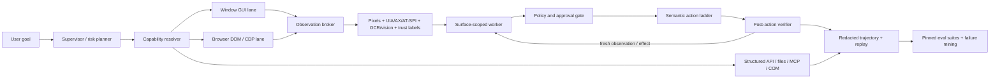

# Computer Use / GUI Agent 技术全景与 Nexa 深度升级建议（2026-08-23）

> 核对时间：2026-08-23（Asia/Shanghai）
> 范围：桌面、浏览器、Windows、Android 的 computer-use / GUI agent；模型、运行时、观察与动作接口、数据与评测、安全。
> 证据策略：只采用论文原文（arXiv/会议）、项目所有者的官方仓库和厂商官方文档。没有把媒体报道、聚合榜单、社区教程或 GitHub issue 当作能力依据。
> 文档性质：这是 `docs/` 下的日期化研究，不是规范性架构；真正的稳定契约仍以 [`computer-use-integration.md`](./computer-use-integration.md) 为准。

## 结论先行

Nexa 不应该把“更强的 computer use”理解为换一个视觉模型或增加几种鼠标动作。当前最强系统的共同形状是：**多观察通道、语义优先的动作阶梯、每步验证、应用专用执行器、可回放轨迹、严格的权限/隔离边界，以及固定版本的执行态评测**。

本次核对了 **28 个具有实际工程价值的项目或论文族**。对 Nexa 最值得直接迁移的结论是：

1. **保持现有 observation/action 分离和短效 observation token。** 这是正确的基础，但 token 应升级为完整的 `observation_id + surface identity + opaque element token`，元素引用只能在产生它的快照内有效。
2. **新增混合观察层。** 同一窗口同时产生截图、可访问性树（Windows UIA；以后是 macOS AX、Linux AT-SPI）、OCR/图标候选和浏览器 DOM/CDP 摘要；不要强迫模型只看像素，也不要假设可访问性树总是完整。
3. **新增语义优先动作阶梯。** 浏览器 DOM ref / UIA pattern → 快照内元素 token → 窗口局部坐标 → 明示审批后的前台系统输入。每次降级都必须可见、可审计、可拒绝。
4. **动作结果必须带验证。** 每次变更动作返回 fresh observation、目标窗口身份、预期效果、实际效果、状态差异和结构化错误；禁止“调用成功即任务成功”。
5. **浏览器单独走结构化 lane。** 对网页优先 Playwright/CDP/DOM refs；视觉点击只处理 canvas、原生对话框、跨应用边界或 DOM 不可信/不可达的区域。
6. **引入应用路由与专用 worker。** 借鉴 UFO² 和 Agent S2：主代理分解跨应用任务，每个 app/window worker 只拥有该表面的最小能力；COM/API/文件工具优先，GUI 是通用回退。
7. **轨迹是一等产物。** 记录观察哈希、元素表、动作、审批、前后状态、错误、耗时、模型与版本；支持脱敏、重放、失败聚类和确定性 evaluator。
8. **先建安全评测再放大自治。** 用 BrowserGym/WebArena、Windows Agent Arena、OSWorld-Verified/2.0 和 DoomArena 分层回归；多 rollout + judge 只在隔离评测或低风险任务中启用。

一个特别重要的现实边界：论文表中的成功率通常来自不同 benchmark 修订、步数预算、环境镜像、模型快照和是否多次 rollout，**不能横向拼成“排行榜”**。本文只把论文数字当作者报告的能力证据，不把它们当 Nexa 的验收值。

## 一、术语与两个必要消歧

### Hermes 到底指什么

与 computer use 直接相关、且最符合用户语境的是 [NousResearch/Hermes Agent](https://github.com/NousResearch/hermes-agent)，不是 Hermes 3/4 模型技术报告，也不是 Apache Hermes 等同名项目。当前 [Hermes Computer Use 官方文档](https://hermes-agent.nousresearch.com/docs/user-guide/features/computer-use)说明：Hermes 的高层 `computer_use` toolset 通过 stdio MCP 调用开源 Cua Driver，在 macOS/Windows/Linux 上组合 AX/UIA/AT-SPI 与平台输入通道；Hermes 自己增加模型无关的动作词汇、审批、诊断和 bounded capability manifest。

因此可迁移的不是“Hermes 模型能力”，而是四个运行时机制：

- `capture(mode="som") → click(element=N) → capture_after` 的快照内元素工作流；
- 后台输入优先、前台输入显式升级；
- 附着已登录浏览器 profile 需要独立于普通工具审批的人类 grant；
- `doctor`/health report 与 bounded manifest 让部署失败和长期自动化边界可诊断、可复核。

### Codex 开源仓库不等于完整桌面 Computer Use

[OpenAI 官方开源组件清单](https://learn.chatgpt.com/docs/open-source)把 Codex CLI、SDK、App Server 等列为开源组件；[Codex 仓库](https://github.com/openai/codex)为 Apache-2.0。但 [Codex / ChatGPT Desktop Computer Use 官方说明](https://learn.chatgpt.com/docs/computer-use)描述的是桌面应用中的插件、应用授权和平台运行时。不能从开源 CLI 仓库推断完整桌面 driver 已开源，也不能照搬社区 issue 中泄露的安装路径作为稳定接口。

OpenAI 真正可复用的公开参考是独立的 MIT [GPT-5.4 CUA Sample App](https://github.com/openai/openai-cua-sample-app)，它展示 Responses loop、native computer 与 Playwright code mode、run-scoped workspace、事件流、replay bundle 和确定性本地场景；它不是 Codex Desktop driver 的源码。

## 二、28 个项目 / 论文族：可迁移机制、代码边界与风险

成熟度标签：**A** = 可优先集成或借鉴的活跃工程；**B** = 可靠参考实现/评测基础设施；**C** = 研究代码或模型，需隔离验证；**D** = 闭源产品/API 或论文机制，只能借鉴契约。

### A. 厂商能力与可运行参考

| # | 项目与一手来源 | 论文能力 / 可用代码边界 | 最值得迁移的机制 | 许可证、成熟度与主要风险 |
|---:|---|---|---|---|
| 1 | [OpenAI Responses `computer` tool](https://developers.openai.com/api/docs/guides/tools-computer-use) | 当前官方文档已把旧 `computer-use-preview` 迁移到 GA `computer` tool：模型返回有序 `actions[]`，调用方执行并回传新截图。支持 built-in loop、自定义 harness、以及 Playwright/PyAutoGUI REPL 式 code-execution harness；模型与服务闭源。 | 标准化 `computer_call → actions[] → computer_call_output`；批动作；视觉、普通工具和代码执行三种 harness 共存；隔离 VM、页面内容不可信、人类审批。 | 专有 API，**D**。批动作会跨越 UI 状态变化；必须 stop-on-first-mismatch。官方明确要求独立安全边界，语言级 sandbox 不是安全边界。 |
| 2 | [OpenAI GPT-5.4 CUA Sample App](https://github.com/openai/openai-cua-sample-app) | 可运行 TypeScript 参考：operator console、Fastify runner、run-scoped mutable workspace、SSE、replay schema、local deterministic labs；同时实现 native 与 persistent Playwright JS REPL。README 明示 safety acknowledgement 尚未实现。 | 同一 scenario/replay/evaluator 驱动 native 与 code 两条 lane；把运行失败、runner offline 和轨迹审阅做成 operator UI；live smoke test 由 secret gate 控制。 | MIT，**B**。浏览器为主、不是通用桌面 runtime；官方明确不应连到已登录、高风险环境，不能直接生产化。 |
| 3 | [Codex / ChatGPT Desktop Computer Use](https://learn.chatgpt.com/docs/computer-use) | 产品可在 Windows/macOS 操作桌面；Windows 前台、macOS 可 locked use。应用授权与文件/shell sandbox 分离；完整桌面 computer-use runtime 未在官方 OSS 清单中作为可复用组件发布。 | app-level allow/always-allow；系统权限、app approval、文件/shell权限三层分离；Windows 只控制 active desktop；用户本地输入打断/重锁。 | 专有产品能力，**D**；[Codex CLI](https://github.com/openai/codex)本身 Apache-2.0。不要复制未公开协议或依赖私有安装布局。 |
| 4 | [Anthropic Computer Use](https://platform.claude.com/docs/en/agents-and-tools/tool-use/computer-use-tool) 与 [官方 quickstart](https://github.com/anthropics/claude-quickstarts/blob/main/computer-use-demo/README.md) | 当前 `computer_toolset_20260801` 是 client-executed member-tool schema：`toolset_name: "computer"`，由 `screenshot`、`left_click` 等 17 个成员工具组成且不再要求 beta header；旧 `computer_20251124` 等版本才是单一 `computer` + `action` 的 beta schema。调用方仍负责截图与输入。 | 精确图像缩放和坐标反映射；zoom/crop；图片历史裁剪、prompt caching、compaction、batch tool calls、sandboxed shell、trajectory recording；弱分离 demo 与生产边界明确区分。 | API 专有；quickstarts MIT，**B/D**。官方仍把整体 computer-use 能力标为 beta，但这不等于最新版 API 仍使用 beta header。官方 demo 单 session 且组件弱分离；网页 prompt injection、凭据和截图留存风险高。 |
| 5 | [NousResearch Hermes Agent](https://github.com/NousResearch/hermes-agent) 与 [Computer Use 文档](https://hermes-agent.nousresearch.com/docs/user-guide/features/computer-use) | 活跃的模型无关个人 agent；可运行高层 computer-use toolset，底层委托 Cua Driver；不是 Hermes 模型权重自身的 GUI 能力。 | 高层紧凑单工具 schema；SoM + AX tree；`capture_after`；危险输入硬拦截；existing-profile 独立 grant；bounded manifest；doctor 诊断矩阵。 | MIT，**A/B**。单租户 host 权限很大；官方 security posture要求 whole-process sandbox 才能处理不可信输入。已登录 profile 暴露 cookies/storage，默认必须 fail closed。 |
| 6 | [Cua / Cua Driver](https://github.com/trycua/cua) 与 [接口契约](https://cua.ai/docs/reference/cua-driver/contracts) | 开源跨平台 driver、SDK、CLI/MCP 和 sandbox 基础设施；窗口级后台控制为核心。Windows 使用 UIA/MSAA/PostMessage/必要时 SendInput，macOS 使用私有 SkyLight 路径，Linux 使用 AT-SPI/XTest/Wayland 通道。 | 精确 `{pid, window_id}` target；窗口局部坐标；语义 action 与 pixel action 分层；后台失败返回明确错误再由调用方决定前台升级；opaque element token + snapshot freshness；多 agent synthetic cursor。 | MIT，**A/C**。macOS 私有 SPI 有兼容与签名风险；并非所有 app 接受后台输入。应该借鉴契约并按平台选择实现，不能假设“永不抢焦点”总能成立。 |
| 7 | [Microsoft UFO² / UFO³](https://github.com/microsoft/UFO) | UFO² 是 Windows Desktop AgentOS，仓库标为 LTS；UFO³扩展到多设备 DAG 调度。公开代码覆盖 HostAgent、per-app AppAgent、UIA 与 COM/API/CLI 混合执行、MCP action server、RAG/经验。 | HostAgent 只做 app 路由和跨 app 计划；AppAgent 隔离到单应用；同一 command envelope 下 API/COM 优先、UIA 回退；黑板汇报；能力匹配和动态 DAG 重写。 | MIT，**A/B**。系统复杂、Windows/Office 倾向强；RAG/网页知识会引入不可信内容。Nexa 应迁移 seam，不应整套嵌入。 |
| 8 | [Microsoft OmniParser + OmniTool](https://github.com/microsoft/OmniParser) 与 [论文](https://arxiv.org/abs/2408.00203) | OmniParser 把截图解析为交互区域和图标语义；仓库还提供 OmniTool 驱动 Windows 11 VM，并支持多种 VLM。代码和权重可下载，论文结果不是执行可靠性的保证。 | 当 UIA/DOM 稀疏时生成视觉 element candidates；图标检测 + caption；把 interactable probability、source、confidence 放入元素表；轨迹本地记录可转训练数据。 | 仓库 CC-BY-4.0，**C**；当前 `icon_detect_v3`/caption 权重说明为 MIT，但旧 Ultralytics detector 保留 AGPL。代码、模型、数据必须逐项做许可证 SBOM，不能只看仓库首页。 |

### B. 浏览器自动化与实验运行时

| # | 项目与一手来源 | 论文能力 / 可用代码边界 | 最值得迁移的机制 | 许可证、成熟度与主要风险 |
|---:|---|---|---|---|
| 9 | [Microsoft Playwright MCP](https://github.com/microsoft/playwright-mcp) | 活跃 MCP server；用 accessibility snapshots 和确定性 Playwright actions 驱动网页，不要求视觉模型。官方同时建议高吞吐 coding agent 考虑 CLI + skill 以减少 tool schema/context 成本。 | DOM/AX snapshot refs；工作区 hash 隔离 profile；isolated/storage-state/persistent 三种会话；action/navigation/settle 分离超时；文件访问默认限制到 workspace。 | Apache-2.0，**A**。origin allow/block list官方明确不是安全边界且不覆盖 redirect；persistent profile并发冲突；`browser_evaluate`、RCE-equivalent 的 `browser_run_code_unsafe`、现有 profile和 unrestricted file access 必须高风险审批。 |
| 10 | [Browser Use](https://github.com/browser-use/browser-use) | 活跃 Python agent/CLI；当前 CLI 使用持久 CDP daemon、元素 index state，并可 headless/headed/real profile/attach。开源 agent 与商业 cloud 能力不同。 | 快速 `state → indexed action`；浏览器在命令间存活；CDP 直接通道；独立 strict judge 审阅轨迹；浏览器 session 与 agent task 分离。 | MIT，**A**。真实 Chrome/profile 模式直接暴露登录态；cloud 的反检测/代理/验证码能力不是 OSS 保证；Chrome-only CDP lane 不能代替跨浏览器测试。 |
| 11 | [BrowserGym](https://github.com/ServiceNow/BrowserGym) 与 [生态论文](https://arxiv.org/abs/2412.05467) | Gym 式浏览器环境，可统一 MiniWoB、WebArena、VisualWebArena、WorkArena 等；是研究/评测框架，不是消费者自动化产品。 | `AbstractBrowserTask`、统一 observation/action/reward；同一 agent 跑多 benchmark；轨迹和 benchmark adapter 解耦；把本地 web QA 也包装成 task。 | Apache-2.0，**A/B**。依赖 benchmark 站点/版本，实时网页有漂移；不要把 benchmark reward 当生产任务成功判据。 |
| 12 | [ServiceNow AgentLab](https://github.com/ServiceNow/AgentLab) | BrowserGym 上的 agent 实验层：Ray 并行、超时杀 worker、study resume、结果分析、trajectory UI、reproducibility journal。不是用户产品。 | `Study` 固化 package/benchmark/commit/model；失败任务可续跑；任务依赖感知并行；AgentXray 逐步查看 observation/action；replay consistency agent。 | Apache-2.0，**A/B**。并行任务会相互污染共享站点，仓库也明确提示；Nexa 评测必须每 run 独立 snapshot，不能共享登录状态。 |
| 13 | [WebArena](https://github.com/web-arena-x/webarena) 与 [论文](https://arxiv.org/abs/2307.13854) | 真实、自托管网站集和 812 个长程网页任务/示例的 canonical reproduction；仓库自身建议新实验通过 BrowserGym/AgentLab 运行。 | 自托管 GitLab、购物、论坛、CMS；execution-based evaluator；固定初态、任务配置和人工轨迹；检验跨 tab、表单与副作用。 | Apache-2.0，**B**。原 repo偏复现旧论文；站点状态污染、任务泄漏和 evaluator bug都可能扭曲分数，应使用 verified/pinned adapter。 |
| 14 | [Emergence AI Agent-E](https://github.com/EmergenceAI/Agent-E) 与 [论文](https://arxiv.org/abs/2407.13032) | 可运行 browser-first agent，基于 AG2/AutoGen；把网页操作拆成 sensing/action skills，并有层级规划分支。论文/README结果使用特定 branch 与旧模型，不能当当前默认表现。 | 人类可理解的原子 skills，而非任意模型代码；DOM content-type感知；skill outcome自然语言反馈；FastAPI streaming wrapper；真实站点任务集。 | MIT，**B/C**。真实网页测试波动大；本地模型支持官方称未充分测试；自由文本 outcome 应改为结构化 effect/error。 |

### C. GUI foundation models、grounding 与长程 agent 方法

| # | 项目与一手来源 | 论文能力 / 可用代码边界 | 最值得迁移的机制 | 许可证、成熟度与主要风险 |
|---:|---|---|---|---|
| 15 | [OpenCUA](https://github.com/xlang-ai/OpenCUA) 与 [论文](https://arxiv.org/abs/2508.09123) | 开放 AgentNet 数据、采集工具、DataProcessor、AgentNetBench、7B/32B/72B 模型和 OSWorld agent；vLLM 已支持模型。训练 pipeline仍有 TODO，论文分数来自指定模型/步数。 | 人类演示同时录 video、mouse/keyboard、AX tree；action reduction；把 action 对齐到动作前最后一个视觉不同帧，避免未来信息泄漏；离线 action evaluator；三帧短历史。 | MIT（项目声明含模型/数据/工具/代码），**C**。`trust_remote_code`、大 GPU、22.6K 轨迹的隐私/许可和合成 CoT 风险；不要保存或训练用户敏感轨迹。 |
| 16 | [UI-TARS / UI-TARS Desktop](https://github.com/bytedance/UI-TARS-desktop)、[UI-TARS 论文](https://arxiv.org/abs/2501.12326)、[UI-TARS-2](https://arxiv.org/abs/2509.02544) | 公开模型/推理代码与桌面应用；UI-TARS-2论文强调 data flywheel、多轮 RL、GUI + filesystem + terminal混合环境、统一 rollout sandbox。桌面 repo已有可下载 release，但历史文档仍有单屏/Windows不稳定说明。 | end-to-end screenshot→action adapter；本地/远端 operator抽象；hybrid GUI+terminal/file rollout；多轮 RL 的稳定环境；截图 detail calculator；轨迹 replay。 | Desktop 代码 Apache-2.0，**B/C**；模型许可应按具体 model card核对。不要采信跨版本 headline 分数；HTTP MCP、浏览器 profile、单/多屏和坐标缩放是高风险面。 |
| 17 | [ShowUI](https://github.com/showlab/ShowUI) 与 [论文](https://arxiv.org/abs/2411.17465) | 2B 端到端 vision-language-action 模型、训练/推理/API和导航 evaluator 均公开。论文提出 UI-guided visual token selection 与 interleaved VLA streaming。 | 以 UI 连通图压缩冗余视觉 token；混合 grounding/navigation 数据重采样；轻量 actor 可作为大模型 planner 的局部 grounding service；迭代 refinement。 | Apache-2.0，**C**。模型/数据依赖另行审计；grounding accuracy 不等于长程成功；本地量化可能显著掉点。 |
| 18 | [CogAgent](https://github.com/zai-org/CogAgent) 与 [论文](https://arxiv.org/abs/2312.08914) | 公开 9B GUI VLM、推理与微调代码；支持 screenshot + history 的严格 Action-Operation-Sensitive 输出。在线 demo不控制电脑。 | 将 action、grounded box、element info 和操作敏感性放在统一结构；每轮显式回放紧凑历史；planner 与 execution model区分。 | 代码 Apache-2.0，模型有独立 `MODEL_LICENSE`，**C**。BF16 推理约需 29GB VRAM，量化有明显退化；禁止用正则/`exec`直接执行模型文本。 |
| 19 | [SeeClick + ScreenSpot](https://github.com/njucckevin/SeeClick) 与 [论文](https://arxiv.org/abs/2401.10935) | 视觉 GUI grounding 模型、数据、代码和跨 mobile/desktop/web ScreenSpot benchmark公开；主要输出归一化 point/bbox。 | 用独立 grounding microservice评测 text/icon/widget；统一 `[0,1]` 坐标并保留原始尺寸/缩放矩阵；把 grounding 从 planner 中拆出单测。 | 代码 Apache-2.0，**C**；数据和 checkpoint沿用各自原始许可。旧 benchmark较易饱和，不能替代 ScreenSpot-Pro/真实 task；点命中不代表控件可执行。 |
| 20 | [Agent S / S2 / S3](https://github.com/simular-ai/Agent-S)、[S2论文](https://arxiv.org/abs/2504.00906)、[S3论文](https://arxiv.org/abs/2510.02250) | S1公开 experience-augmented hierarchical planning；S2引入 compositional generalist-specialist；S3论文用多 rollout + Behavior Judge，把执行轨迹转成 behavior narrative再选择。代码公开，但复现实验依赖模型、环境和较大推理预算。 | 经验检索分层；generalist分解 + specialist执行；失败经验不过度泛化；对低风险任务并行多次 rollout，再用行为级 judge而不是只看最后截图。 | Apache-2.0，**B/C**。作者报告 S3 在 OSWorld 72.6%，但这是多 rollout系统，成本与单次执行不可比；judge可被共享错误/注入欺骗，不能在真实副作用环境中并行试错。 |
| 21 | [BAAI Cradle](https://github.com/BAAI-Agents/Cradle) 与 [论文](https://arxiv.org/abs/2403.03186) | 公开 screenshot + keyboard/mouse 通用控制框架，覆盖游戏与若干桌面软件；包含 action planning、information gathering、self-reflection、task inference 和自动 skill curation。 | 游戏/实时 UI 的 pause-act-unpause；按环境生成并积累 skills；把视觉难认图标替换为语义；环境 adapter 显式建模实时性。 | MIT，**C**。仓库更新和环境覆盖有限，迁移新 app仍需专用配置；自动 skill需来源、版本和审批，不能把失败轨迹永久学习。 |

### D. OS / Mobile benchmark、安全与端侧框架

| # | 项目与一手来源 | 论文能力 / 可用代码边界 | 最值得迁移的机制 | 许可证、成熟度与主要风险 |
|---:|---|---|---|---|
| 22 | [OSWorld / OSWorld-Verified](https://github.com/xlang-ai/OSWorld) 与 [论文](https://arxiv.org/abs/2404.07972) | 真实 Ubuntu/Windows/macOS 环境、369任务、初态 setup和执行态 evaluator；2025 Verified 修复任务与信号并重跑模型。代码、环境、baseline公开。 | VM snapshot reset；每任务自定义执行态检查，而不是图像 judge；跨 app/files/browser真实工作流；独立 guest server；失败可回放。 | Apache-2.0，**A/B**。VM、浏览器账号、下载资源和云 provider使复现昂贵；只比较同一 verified revision、步数与环境。 |
| 23 | [OSWorld 2.0](https://github.com/xlang-ai/OSWorld-V2) | 2026 的长程真实任务版本；官方 release固定 108 个任务和环境资产，并把 task classes/敏感 assets放在 gated dataset，减少 agent在线读取 evaluator造成 benchmark leakage。 | release manifest + hash；main与支持 release严格分开；任务/evaluator不出现在 agent可访问文件系统；mocked/self-host网站；长程 checkpoint。 | Apache-2.0，**B**；task/assets gated，部署更复杂；不能把私有 token放进可被 agent看到的环境变量或文件。 |
| 24 | [Microsoft Windows Agent Arena / Navi](https://github.com/microsoft/WindowsAgentArena) 与 [论文](https://arxiv.org/abs/2409.08264) | Windows 11 VM、150+任务、Azure并行 runner、BYOA接口和 Navi/OmniParser baseline公开；本地 golden image约30GB。 | Windows专属回归；`predict/reset`最小 agent接口；normal/hard初态；云并行；将 VM snapshot备份在 agent不可写位置。 | MIT，**A/B**。Windows ISO/许可证、GPU parser与Azure成本；共享 golden image若被 agent污染会产生假结果。 |
| 25 | [Google Research AndroidWorld](https://github.com/google-research/android_world) 与 [论文](https://arxiv.org/abs/2405.14573) | live emulator、116手工任务/20 apps，参数动态生成可形成大量变体，reward信号耐久；代码可运行，Docker仍实验性。 | 参数化任务防记忆；screenshot + UI elements并行 observation；per-task human-time-derived step budget；checkpoint resume；轻量环境接口。 | Apache-2.0，**A/B**；官方注明不是受支持的 Google 产品。需要 privileged emulator/ADB，Docker与Apple Silicon性能有已知限制。 |
| 26 | [Mobile-Agent / GUI-Owl / ToolCUA](https://github.com/X-PLUG/MobileAgent) | 活跃的移动/跨平台 agent家族；v2多 agent，v3/v3.5加入 planner、progress、reflection、memory与GUI-Owl；2026 ToolCUA研究 GUI 与工具路径切换。代码和部分模型公开。 | planner/progress manager/decision/reflection分工；跨平台统一 action profile；根据任务在 GUI、MCP/tool、文件/终端之间动态路由；critic做执行前错误诊断。 | MIT repo，**B/C**；具体模型权重/云 API另行许可。ADB控制真实手机风险大；多 agent放大 token、延迟和共识错误。 |
| 27 | [Tencent AppAgent / AppAgentX](https://github.com/TencentQQGYLab/AppAgent) | 可运行 Android agent；通过自主探索或人类演示生成 app-specific knowledge，再用于部署；AppAgentX增加 evolving机制。 | 新 app先在隔离副本探索并生成可人工修订文档；知识条目绑定 app/version/screen signature；grid overlay作为无标签 UI 的回退。 | MIT，**C**。旧默认模型/API、真实设备ADB和探索副作用；项目展示通过 CAPTCHA 不应转化为绕过安全控制的产品目标。 |
| 28 | [ServiceNow DoomArena](https://github.com/ServiceNow/DoomArena) 与 [论文](https://arxiv.org/abs/2504.14064) | 可安装的模块化 agent security framework，已有 BrowserGym、OSWorld、tau-bench、mail等 adapter；用户可定义 threat model、AttackGateway和注入攻击。 | 把观察、工具结果、邮件、网页等攻击面变成可插拔 gateway；按资产/攻击者能力定义威胁模型；同一攻击套件跨环境复用；安全回归成为 CI。 | Apache-2.0，**A/B**。测试攻击代码必须只在无凭据隔离环境；安全分数不能证明生产安全，仍需真实权限边界和红队。 |

补充说明：[OpenHands Open Operator](https://github.com/OpenHands/open-operator) 名字很容易被误认为可运行的 Operator 克隆；官方仓库实际是能力清单、benchmark资料和开放/闭源项目索引，不是完整 computer-use runtime。它适合做 taxonomy，不应列为 Nexa 的代码依赖或性能依据。

## 三、从这些系统抽象出的先进共识

### 1. 最强形态不是 pure vision，而是可退化的混合控制

Pure-vision模型的价值是真正跨 app、跨渲染技术；但工程可靠性最高的路径是：

1. 结构化 API / 文件 / COM / MCP；
2. 浏览器 DOM/CDP 或原生 accessibility pattern；
3. snapshot-scoped element token（来自 UIA/AX/AT-SPI/OmniParser/SoM）；
4. 窗口局部像素；
5. 经明确审批的前台系统级输入。

UFO²、Playwright MCP、Hermes/Cua、Anthropic Browser Use Demo 和 OpenAI 的 custom/code harness都指向同一个结论：**GUI 是通用接口，但不应成为每一步的唯一接口**。Nexa 应把它做成 capability resolver，而不是让模型自己凭文本决定是否绕过更安全的 lane。

### 2. “元素引用”必须是能力，不是坐标别名

元素引用应携带观察快照、窗口身份和失效语义。仅返回 `element=7` 而不绑定 snapshot，会产生 TOCTOU：重绘、窗口切换或弹窗后，编号可能指向另一个控件。

推荐 opaque token 的服务器内部内容至少绑定：

```text
observation_id + surface_id + process_identity + window_id/tab_id
+ element_source + source_local_id + bounds_hash + issued_at
```

调用方不得解析 token；执行器验证当前 process/window/tab、最新 observation、bounds/role/name 的允许漂移，再决定执行或返回 `stale_observation` / `target_changed` / `element_changed`。这延续了 Nexa 已有短效 observation token，同时吸收了 Cua Driver 的 snapshot/token契约和浏览器 ref 机制。

### 3. 观察不是一张 PNG，而是带信任标签的状态包

一个生产级 observation 应同时回答：模型看到了什么、这些信息从哪里来、坐标如何解释、哪些内容不可信、当前能安全执行什么。

```json
{
  "observation_id": "obs_...",
  "captured_at": "2026-08-23T...Z",
  "expires_at": "2026-08-23T...Z",
  "surface": {
    "kind": "window|browser_tab|desktop|mobile",
    "surface_id": "...",
    "process_id": 1234,
    "process_start_time": "...",
    "window_id": "...",
    "tab_id": "..."
  },
  "frame": {
    "width": 1280,
    "height": 800,
    "coordinate_space": "window_local",
    "scale_to_native": [1.0, 1.0],
    "image_ref": "ephemeral:...",
    "redactions": []
  },
  "elements": [
    {
      "token": "elt_opaque_...",
      "source": "uia|dom|ocr|vision",
      "role": "button",
      "name": "Save",
      "bounds": [100, 40, 80, 28],
      "enabled": true,
      "confidence": 0.99,
      "trust": "untrusted_ui_content"
    }
  ],
  "capabilities": ["semantic_click", "window_pixel_click", "type_text"],
  "warnings": ["occluded_but_captured", "page_content_is_untrusted"]
}
```

关键约束：pixels、DOM、UIA/OCR文字、PDF/email/chat内容全部是 **untrusted data**；它们能影响任务事实判断，但不能授予权限、扩大目标 app/domain或取消审批。

### 4. action 需要意图、预期效果和降级记录

推荐统一动作包：

```json
{
  "observation_id": "obs_...",
  "target": { "element_token": "elt_..." },
  "action": { "type": "click", "button": "left" },
  "intent": "open Save dialog",
  "expected_effect": {
    "kind": "dialog_appears",
    "role": "dialog",
    "name_contains": "Save"
  },
  "fallback_policy": "semantic_only|allow_window_pixel|require_foreground_approval",
  "approval_context_id": "approval_..."
}
```

结果不能只返回 `ok`：

```json
{
  "status": "verified|executed_unverified|blocked|stale|failed",
  "route": "uia_invoke|dom_click|window_pixel|foreground_send_input",
  "effect": "changed|unchanged|ambiguous",
  "pre_observation_id": "obs_...",
  "post_observation_id": "obs_...",
  "focused_surface_id": "...",
  "verification": { "matched": true, "evidence": ["dialog:Save As"] },
  "error": null
}
```

这样 planner能够区分：输入没有送达、送达但没有变化、界面变化但不是预期、目标已陈旧、操作被策略阻止。Hermes 的 `capture_after`、Nexa现有 fresh post-action screenshot、OpenAI/Anthropic循环和OSWorld execution evaluator都支持这个方向。

### 5. 批动作只能在可证明安全的边界内使用

OpenAI GA computer tool与Anthropic最新参考强调 batch以减少 round-trip，但盲目执行整个 `actions[]` 会破坏 observation freshness。建议：

- 同一批内只允许不依赖中间重定位的动作，例如 click已验证文本框后紧接 type；
- 每个动作仍有独立 action index、policy check和 stop-on-error；
- 导航、窗口切换、弹窗、提交、下载、权限提示、删除/支付等动作后强制截断批次并重新观察；
- 任何坐标动作若前一步改变布局，后续坐标动作全部作废；
- 审批必须覆盖批内每个副作用，而不是只看自然语言总目标。

### 6. 长任务可靠性来自层级、进度状态与验证，不来自更长自由文本 CoT

UFO²、Agent S2、Mobile-Agent和Cradle的共同模式可以压缩成三层：

- **Supervisor**：维护用户目标、跨 app DAG、风险预算和终止条件；不直接点击。
- **Surface worker**：一次只绑定一个 app/window/tab，维护局部 subgoal、observation history和重试预算。
- **Executor/verifier**：执行严格动作 schema，产生fresh observation和effect evidence，不参与开放式规划。

进度状态必须是结构化的：`pending / active / verified / blocked / skipped / failed`。只有 verifier evidence 能把步骤变成 `verified`。经验/skill memory只保存经过验证、脱敏且绑定 app/version 的成功模式；失败和人工纠正也保存，但不自动升级为可执行 skill。

### 7. 多 rollout + judge 有价值，但只能用于合适的任务

Agent S3 的 Behavior Judge证明多次执行和行为叙事比较可以显著提高 benchmark成功率。Nexa可迁移为：

- 在**无外部副作用**的本地测试/VM中并行 N 个 rollout；
- 每条轨迹转成来自结构化事件的 behavior summary，而不是让同一模型自由编故事；
- judge比较任务约束、验证证据、违规/审批、步数和成本；
- 只有通过 deterministic evaluator 的候选才可胜出。

真实邮箱、生产后台、购买、发布、删除、账号设置不允许并行试错。对这类任务，多 rollout只能发生在 plan simulation，实际执行仍为单路径、逐步审批。

## 四、建议的 Nexa 目标架构



### 运行时边界

1. **Agent process不拥有输入注入。** 它只能调用本地受信 broker；broker独立验证target、token、policy和approval。
2. **Observation broker最小权限。** 只捕获已授权surface；返回临时image ref，不写默认持久文件；任何持久化必须经过trace redactor。
3. **Browser runner与API client分进程。** Playwright/CDP或模型生成代码运行在无host mount、无继承env、资源/网络受限的容器/VM；Node `vm`、Python受限globals不算安全隔离。
4. **Foreground escalation是显式事件。** 后台语义/像素失败不会静默切到SendInput；返回 `background_unavailable`，由policy/用户决定单动作升级。
5. **凭据通过broker注入。** 模型不能读密码/API key；登录或2FA由用户接管，或用站点限定、不可导出的secret handle。截图、DOM、日志和replay先脱敏再离开本机。

### 观察与动作 adapter

建议把模型供应商、视觉模型和driver适配分开：

```text
ModelAdapter
  - OpenAI computer actions[]
  - Anthropic computer tool_use
  - Generic structured tool model
  - Local GUI model (UI-TARS/OpenCUA/ShowUI/CogAgent)

ObservationAdapter
  - Windows WGC + UIA
  - Browser Playwright/CDP + screenshot
  - Future macOS AX / Linux AT-SPI / AndroidWorld-like UI tree
  - Optional OmniParser/grounding service

ActionAdapter
  - UIA semantic patterns
  - DOM/ref actions
  - Window-local background input
  - Foreground SendInput (approval-only)
```

Model输出统一转换为Nexa内部typed action，**绝不执行模型生成的Python/JavaScript字符串或 `pyautogui.*`文本**。只有专门code-mode sandbox可执行代码，而且它与host driver、API key和用户文件系统分离。

## 五、安全升级：必须随能力一起交付

### 风险分级

| 级别 | 示例 | 默认策略 |
|---|---|---|
| R0 观察 | 已授权窗口截图、UIA tree、无凭据本地页面 | 自动；仍进行敏感区域遮罩与审计 |
| R1 可逆局部操作 | 滚动、切tab、在未提交表单输入非敏感文本 | task-scoped approval；可配置 always allow app |
| R2 外部/持久副作用 | 保存文件、下载、发送草稿、改设置、打开新app/profile | 每类能力审批；验证目标和post-state |
| R3 高影响 | 提交表单、发送消息、发布、删除、购买、账号/权限变更 | just-in-time逐动作确认；展示精确对象和最终值 |
| R4 禁止/人工接管 | 密码、2FA、验证码绕过、金融/医疗关键决定、系统安全控制绕过 | driver硬阻止或用户接管；模型不得代输secret |

“用户让 agent 完成任务”不等于用户授权网页、邮件或截图中的新指令。任何来自UI的“继续点击”“上传文件”“关闭安全设置”等文字都按不可信内容处理。

### 应新增的硬门槛

- app/domain/window allow policy和短效grant；`always allow`必须可查看、可撤销、绑定稳定app identity；
- process start time + executable identity重验证，防止PID复用/窗口劫持；
- 元素token只能单快照使用，导航/窗口切换/分辨率/DPI/布局显著变化立即失效；
- clipboard默认不可读，写入也需要分类；secret绝不进入clipboard；
- download/upload、file picker、打印、摄像头/麦克风、浏览器扩展安装是独立能力；
- 网络默认deny或task allowlist；origin allowlist不是安全边界，redirect、DNS、service worker和download destination单独控制；
- local user mouse/keyboard input可立即暂停，且清除agent未执行动作队列；
- 每个run有wall-clock、step、token、cost、retry、foreground和external-side-effect预算；
- screenshot/trace retention默认短期、加密、可删除；敏感窗口和通知区域遮罩。

### 必须测试的攻击

使用DoomArena式AttackGateway和自建fixtures覆盖：

- 网页/图片/邮件/PDF中的直接和间接prompt injection；
- UI文字诱导扩大domain/app范围；
- stale element、窗口切换、overlay/clickjacking、DPI/缩放、多显示器；
- 恶意MCP/tool result、超长AX tree、隐藏DOM、伪造disabled/role；
- 浏览器redirect到私网、metadata endpoint、`file://`、download后自动执行；
- 截图/日志/错误消息泄露token、密码、通知和其他窗口；
- 模型输出畸形action、超范围坐标、无限wait/scroll、批动作中途状态突变；
- driver崩溃/重启后复用旧token、daemon跨session串状态；
- 人工输入与agent输入竞争、foreground escalation未恢复原窗口。

## 六、评测体系：从 microbench 到真实长程任务

### L0：确定性单元与属性测试（每次提交）

- 坐标缩放/letterbox/crop/zoom往返误差；
- observation/element token过期、PID复用、窗口身份变化；
- typed action schema fuzz、未知action fail closed；
- R0-R4 policy矩阵、批动作stop-on-first-mismatch；
- screenshot redaction和trace secret scanner；
- 输入route选择与foreground escalation审批。

### L1：本地GUI microbench（PR）

构建不联网的小应用/网页，覆盖button、菜单、combobox、tree、table、drag/drop、canvas、富文本、文件对话框、通知、modal、多窗口、遮挡、最小化、125%/150% DPI。每个任务用应用内部状态或文件hash做 evaluator，不能只看截图。

核心指标：

- grounding hit rate（按text/icon/widget、尺寸、DPI分桶）；
- semantic action success / pixel fallback / foreground escalation比例；
- post-action verification precision/recall；
- stale/target-changed正确拒绝率；
- 每成功任务steps、latency、tokens、截图bytes、approval次数；
- prompt-injection policy violation和secret exposure必须为0。

### L2：浏览器与Windows回归（nightly）

- BrowserGym MiniWoB作为快速确定性回归；
- WebArena/VisualWebArena用固定镜像和版本；
- Windows Agent Arena normal/hard覆盖Windows native apps；
- DoomArena在BrowserGym adapter上跑注入/工具污染。

### L3：跨应用长程（weekly / release gate）

- OSWorld-Verified固定release、镜像、步数和模型snapshot；
- OSWorld 2.0使用官方release manifest，不让agent访问task/evaluator；
- 若支持移动端，再加入AndroidWorld参数化任务；
- 每个基准至少3次独立run，报告mean、variance、失败类型和成本，不只报最高分。

发布报告必须记录：Nexa commit、driver版本、模型精确ID/snapshot、prompt/action schema版本、benchmark release、镜像hash、step budget、是否多rollout/人工介入、成功判据和排除任务。否则结果不可复现也不可比较。

## 七、实施路线图

### P0：先把现有 Windows lane 深化为可验证的混合控制

1. 扩展 `computer_observe`：返回UIA element table、role/name/bounds/enabled/source/confidence以及opaque element token；截图仍为临时数据。
2. 扩展 `computer_control`：新增element-token语义click/invoke/toggle/value/select；保留窗口局部pixel作为回退。
3. 把现有 observation token升级为上文snapshot contract；所有动作重验process start time、window identity、expiry和元素漂移。
4. 统一ActionResult：route、effect、focused surface、fresh observation、verification和稳定error codes。
5. 实现策略化降级：UIA → window pixel；foreground SendInput保持显式高风险审批，不静默降级。
6. 增加本地deterministic GUI lab和坐标/DPI/过期token回归。

验收：所有变更动作都产生fresh observation或结构化观察错误；旧token、换窗和PID复用100% fail closed；本地fixture不以截图judge决定成功。

### P1：浏览器动作 lane、轨迹与生产安全

1. 加固现有受权限控制的 `browser_session` 交互 lane；继续优先 DOM/ARIA/Playwright refs，并与只读诊断工具 `browser_evidence_capture` 明确分工，保持public/loopback/private-network策略。
2. browser profile分为ephemeral、workspace-persistent、existing-profile；existing-profile需要独立human grant和清晰风险提示。
3. 引入run-scoped replay schema、SSE/stream events、artifact redaction和trace viewer；参考OpenAI CUA sample与AgentLab。
4. 增加R0-R4 policy、domain/app能力、预算、人工输入中断和逐动作高影响确认。
5. 把DoomArena式攻击fixture纳入nightly；禁止页面内容授予权限。
6. 图像历史采用关键帧 + 最近帧 + crop/zoom，裁掉重复截图；对模型/供应商实现capability profile。

验收：浏览器结构化lane覆盖普通网页流程，canvas/原生对话框才落到视觉；prompt injection套件无越权动作；replay能从事件解释每一次执行和审批。

### P2：层级执行、开放模型与规模化评测

1. 增加Supervisor → surface worker → executor/verifier结构，以及跨app DAG/blackboard。
2. 把COM/API/file/MCP与GUI放入capability resolver，API优先、GUI回退；每个worker仅获得所需app/domain能力。
3. 提供generic local-GUI-model adapter；先离线shadow评测UI-TARS/OpenCUA/ShowUI等，不直接控制用户主机。
4. 建立BrowserGym/AgentLab、WAA、OSWorld-Verified/2.0 runner；固定release、镜像和成本报告。
5. 仅在VM/低风险任务实验多rollout + Behavior Judge；真实副作用单路径执行。
6. 经用户明确opt-in后收集脱敏失败轨迹；借鉴OpenCUA进行action reduction/state-action alignment，不能默认上传屏幕历史。

验收：同一任务可在模型/driver adapter间A/B且复用同一evaluator；长任务每一步有结构化进度与证据；多rollout报告成本和方差，不伪装成单次能力。

## 八、明确不建议照搬的做法

- 不把整个桌面截图和全量AX tree无裁剪地塞进每一轮；这会增加成本、泄露面和模型混淆。
- 不用自由文本或代码字符串表达动作，不对模型输出调用 `eval`/`exec`。
- 不把浏览器origin allowlist、Docker或语言sandbox单独宣称为安全边界。
- 不默认附着用户真实Chrome profile，不让agent读取密码、2FA、支付信息或secret clipboard。
- 不在主机真实账号上跑多rollout；不能用“judge最后选一个”抵消已经发生的副作用。
- 不把论文SOTA直接写入产品SLA；必须在Nexa固定环境重跑。
- 不把MIT/Apache仓库首页当作所有模型权重、数据集和依赖的许可证；OmniParser、CogAgent、SeeClick等都需要逐artifact审计。
- 不追求所有平台统一实现细节；统一的是target/action/result契约，AX/UIA/AT-SPI/CDP/ADB的可靠性和安全限制必须平台化。

## 九、推荐的最小采纳集合

如果本轮只能选少量外部成果，优先级如下：

1. **接口契约**：OpenAI GA computer loop + Anthropic client-executed tool loop + Cua snapshot/target contract。
2. **Windows控制**：Nexa现有WGC/输入基础上加入UIA语义层；参考Cua Windows action ladder和UFO² app worker，不直接引入私有平台hack。
3. **浏览器**：Playwright MCP/CLI的snapshot ref、profile隔离、文件范围和timeout设计；BrowserGym作为统一测试接口。
4. **视觉回退**：OmniParser/SeeClick概念先作为可选sidecar；初期不把重模型放入默认安装。
5. **轨迹/验证**：OpenAI CUA sample的scenario/replay/evaluator + AgentLab Study/Xray。
6. **安全**：OpenAI/Anthropic隔离与审批规则 + Hermes bounded grants + DoomArena攻击gateway。
7. **长程可靠性**：UFO²/Agent S2分层；Agent S3多rollout仅进入评测实验。

这组采纳路径能显著提升可靠性、可解释性和平台可扩展性，同时不把Nexa绑死在某个闭源模型或某个研究仓库的内部结构上。

## 十、链接核验说明

本文只放入直接的一手资料链接：厂商官方文档、项目所有者官方GitHub仓库或arXiv论文页面。2026-08-23 在写入完成后提取了文中的 **51 个唯一外链**，逐一执行带重定向的HTTP请求；51/51最终均返回HTTP 200，且落点仍为对应官方文档、官方仓库或arXiv页面。没有保留404、登录墙、搜索结果页或跳往非一手资料的链接。
