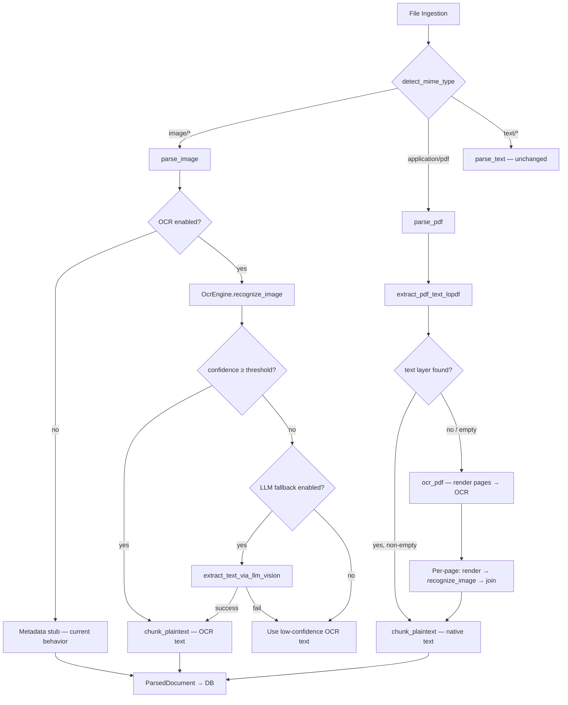

# OCR Architecture Design — PaddleOCR ONNX Integration

**Status:** Proposed  
**Date:** 2026-02-27  
**Scope:** `crates/core` — new `ocr` module + modifications to `parse`, `search`, `ingest`, `error`

---

## 1. Overview

Add ONNX-based PaddleOCR as the **primary** text extraction method for images and scanned PDFs, with LLM Vision API as **fallback** when OCR confidence is low or OCR errors out.

```
Image/PDF Page
     │
     ▼
┌─────────────────────┐
│  ONNX PaddleOCR     │──── text (confidence ≥ threshold) ──→ chunk → index
│  (det → cls → rec)  │
└─────────────────────┘
     │ confidence < threshold OR error
     ▼
┌─────────────────────┐
│  LLM Vision API     │──── text ──→ chunk → index
│  (fallback)         │
└─────────────────────┘
```

---

## 2. PaddleOCR ONNX Model Details

### 2.1 Models (PP-OCRv4)

| Stage | Model File | Purpose | Size |
|-------|-----------|---------|------|
| Detection | `pp-ocrv4-det.onnx` | Locate text regions (bounding boxes) | ~4.5 MB |
| Classification | `pp-ocrv4-cls.onnx` | Detect text orientation (0°/180°) | ~1.4 MB |
| Recognition | `pp-ocrv4-rec.onnx` | CTC-decode characters from each box | ~10 MB |
| Dictionary | `ppocr_keys_v1.txt` | Character dictionary for CTC decode | ~300 KB |

Total: ~16 MB for Chinese+English. Additional rec models can be added for other languages.

### 2.2 Tensor Shapes

#### Detection (det)

| Direction | Name | Shape | Type | Notes |
|-----------|------|-------|------|-------|
| Input | `x` | `[1, 3, H, W]` | `f32` | H,W must be multiples of 32; normalized `(x/255 - mean) / std` |
| Output | `sigmoid_0.tmp_0` | `[1, 1, H, W]` | `f32` | Probability map; threshold at 0.3 → binary mask → contours → boxes |

Pre-processing:
- Resize longest side to `det_limit_side_len` (default 960), keep aspect ratio
- Pad to multiple of 32
- Normalize: `mean=[0.485, 0.456, 0.406]`, `std=[0.229, 0.224, 0.225]`

Post-processing:
- Threshold probability map at 0.3 → binary mask
- Find contours (Suzuki algorithm or `imageproc` connected-components)
- Fit minimum bounding rectangles → sort top-to-bottom, left-to-right
- Expand boxes by `unclip_ratio=1.5` (Vatti clipping)

#### Classification (cls)

| Direction | Name | Shape | Type | Notes |
|-----------|------|-------|------|-------|
| Input | `x` | `[N, 3, 48, 192]` | `f32` | Cropped+resized text regions |
| Output | `softmax_0.tmp_0` | `[N, 2]` | `f32` | `[prob_0°, prob_180°]`; flip if `prob_180° > 0.9` |

#### Recognition (rec)

| Direction | Name | Shape | Type | Notes |
|-----------|------|-------|------|-------|
| Input | `x` | `[N, 3, 48, W]` | `f32` | W = proportional resize to height 48, max 320 |
| Output | `softmax_5.tmp_0` | `[N, W/4, num_classes]` | `f32` | CTC logits; greedy-decode: argmax per step, collapse repeats, strip blanks |

### 2.3 CTC Decode Algorithm

```rust
fn ctc_greedy_decode(logits: &[Vec<f32>], dictionary: &[String]) -> (String, f32) {
    let mut result = String::new();
    let mut confidences = Vec::new();
    let mut prev_idx: usize = 0; // 0 = blank

    for step in logits {
        let (max_idx, &max_val) = step.iter()
            .enumerate()
            .max_by(|a, b| a.1.partial_cmp(b.1).unwrap())
            .unwrap();

        if max_idx != 0 && max_idx != prev_idx {
            if let Some(ch) = dictionary.get(max_idx - 1) {
                result.push_str(ch);
                confidences.push(max_val);
            }
        }
        prev_idx = max_idx;
    }

    let avg_confidence = if confidences.is_empty() {
        0.0
    } else {
        confidences.iter().sum::<f32>() / confidences.len() as f32
    };

    (result, avg_confidence)
}
```

---

## 3. Module Design — `crates/core/src/ocr.rs`

### 3.1 Public Types

```rust
//! OCR module — ONNX-based PaddleOCR for text extraction from images.
//!
//! Provides a lazy-initialized, thread-safe OCR engine using PP-OCRv4
//! ONNX models (detection + optional classification + recognition).
//! Falls back to LLM Vision API when confidence is below threshold.

use std::path::{Path, PathBuf};
use std::sync::{Arc, OnceLock};

use crate::error::CoreError;

// ── Configuration ───────────────────────────────────────────────────

/// User-configurable OCR settings, persisted in the database.
#[derive(Debug, Clone, serde::Serialize, serde::Deserialize)]
#[serde(rename_all = "camelCase")]
pub struct OcrConfig {
    /// Master toggle — set `false` to skip OCR entirely (images become
    /// metadata-only stubs like today).
    pub enabled: bool,

    /// Minimum average CTC confidence (0.0–1.0) to accept OCR output.
    /// Below this threshold the LLM Vision fallback is attempted.
    pub confidence_threshold: f32,

    /// Whether to attempt LLM Vision when OCR confidence is low or errors.
    pub llm_fallback_enabled: bool,

    /// Maximum image dimension (longest side) sent to the detection model.
    /// Larger = more accurate but slower.  Default 960.
    pub det_limit_side_len: u32,

    /// Enable the orientation classifier (cls model).
    /// Disable to save ~10 ms per box when text is known to be upright.
    pub use_cls: bool,

    /// Optional override path for OCR model files.
    /// When empty, defaults to `<data_dir>/ask-myself/models/paddleocr/`.
    pub model_path: String,

    /// ISO 639-1 language codes controlling which rec model + dictionary
    /// to load.  Default: `["en", "zh"]`.
    pub languages: Vec<String>,
}

impl Default for OcrConfig {
    fn default() -> Self {
        Self {
            enabled: true,
            confidence_threshold: 0.6,
            llm_fallback_enabled: true,
            det_limit_side_len: 960,
            use_cls: true,
            model_path: String::new(),
            languages: vec!["en".into(), "zh".into()],
        }
    }
}

// ── OCR Result ──────────────────────────────────────────────────────

/// A single recognized text region with its bounding box and confidence.
#[derive(Debug, Clone)]
pub struct OcrTextRegion {
    /// Recognized text content.
    pub text: String,
    /// Average CTC confidence for this region (0.0–1.0).
    pub confidence: f32,
    /// Bounding box: `[top_left_x, top_left_y, width, height]`.
    pub bbox: [f32; 4],
}

/// Result of running OCR on a single image.
#[derive(Debug, Clone)]
pub struct OcrResult {
    /// All recognized text regions, sorted reading-order (top→bottom, left→right).
    pub regions: Vec<OcrTextRegion>,
    /// Combined full text (regions joined with newlines).
    pub full_text: String,
    /// Average confidence across all regions.
    pub avg_confidence: f32,
    /// Whether the result came from OCR or LLM fallback.
    pub source: OcrSource,
}

/// How the text was extracted.
#[derive(Debug, Clone, PartialEq, Eq, serde::Serialize, serde::Deserialize)]
#[serde(rename_all = "camelCase")]
pub enum OcrSource {
    PaddleOcr,
    LlmVision,
    None,
}
```

### 3.2 OCR Engine (Lazy Singleton)

```rust
// ── Engine (lazy, thread-safe) ──────────────────────────────────────

/// Thread-safe, lazily-initialized PaddleOCR engine.
///
/// Uses `OnceLock` so models are loaded exactly once on first call.  
/// The inner `ort::Session` objects are wrapped in `Mutex` so multiple
/// threads can share the engine without data races (ONNX Runtime itself
/// is thread-safe for inference, but session mutation isn't).
pub struct OcrEngine {
    det_session: std::sync::Mutex<ort::session::Session>,
    cls_session: Option<std::sync::Mutex<ort::session::Session>>,
    rec_session: std::sync::Mutex<ort::session::Session>,
    dictionary: Vec<String>,
    config: OcrConfig,
}

/// Global singleton — initialised on first `ocr_engine()` call.
static OCR_ENGINE: OnceLock<Result<Arc<OcrEngine>, String>> = OnceLock::new();

/// Get or initialise the global OCR engine.
///
/// Returns `Err` with a human-readable message if model files are missing
/// or ONNX sessions fail to build.
pub fn ocr_engine(config: &OcrConfig) -> Result<Arc<OcrEngine>, CoreError> {
    let result = OCR_ENGINE.get_or_init(|| {
        OcrEngine::new(config).map(Arc::new).map_err(|e| e.to_string())
    });

    match result {
        Ok(engine) => Ok(Arc::clone(engine)),
        Err(msg) => Err(CoreError::Internal(format!("OCR engine init failed: {msg}"))),
    }
}

impl OcrEngine {
    /// Build a new engine, loading all three ONNX models + the character
    /// dictionary from disk.
    fn new(config: &OcrConfig) -> Result<Self, CoreError> {
        let model_dir = ocr_model_dir(config)?;

        let det_path = model_dir.join("pp-ocrv4-det.onnx");
        let cls_path = model_dir.join("pp-ocrv4-cls.onnx");
        let rec_path = model_dir.join("pp-ocrv4-rec.onnx");
        let dict_path = model_dir.join("ppocr_keys_v1.txt");

        if !det_path.exists() || !rec_path.exists() || !dict_path.exists() {
            return Err(CoreError::Internal(format!(
                "PaddleOCR model files not found in {}. \
                 Download them from Settings → OCR Models.",
                model_dir.display()
            )));
        }

        let num_threads = std::thread::available_parallelism()
            .map(|n| (n.get() / 2).max(1))
            .unwrap_or(1);

        let det_session = load_onnx_session(&det_path, num_threads)?;
        let rec_session = load_onnx_session(&rec_path, num_threads)?;

        let cls_session = if config.use_cls && cls_path.exists() {
            Some(std::sync::Mutex::new(load_onnx_session(&cls_path, num_threads)?))
        } else {
            None
        };

        let dictionary = std::fs::read_to_string(&dict_path)
            .map_err(|e| CoreError::Internal(format!("read dictionary: {e}")))?
            .lines()
            .map(|l| l.to_string())
            .collect();

        tracing::info!(
            "PaddleOCR engine loaded (det={}, cls={}, rec={}, dict={} chars)",
            det_path.display(),
            if config.use_cls { "yes" } else { "no" },
            rec_path.display(),
            (&dictionary as &Vec<String>).len(),
        );

        Ok(Self {
            det_session: std::sync::Mutex::new(det_session),
            cls_session,
            rec_session: std::sync::Mutex::new(rec_session),
            dictionary,
            config: config.clone(),
        })
    }
}

fn load_onnx_session(path: &Path, num_threads: usize) -> Result<ort::session::Session, CoreError> {
    ort::session::Session::builder()
        .map_err(|e| CoreError::Internal(format!("ort session builder: {e}")))?
        .with_intra_threads(num_threads)
        .map_err(|e| CoreError::Internal(format!("ort intra threads: {e}")))?
        .commit_from_file(path)
        .map_err(|e| CoreError::Internal(format!("ort load model {}: {e}", path.display())))
}

/// Resolve the model directory: user override or default data dir.
fn ocr_model_dir(config: &OcrConfig) -> Result<PathBuf, CoreError> {
    if !config.model_path.is_empty() {
        return Ok(PathBuf::from(&config.model_path));
    }
    let data_dir = dirs::data_dir()
        .ok_or_else(|| CoreError::Internal("cannot determine data directory".into()))?;
    Ok(data_dir.join("ask-myself").join("models").join("paddleocr"))
}
```

### 3.3 Public API — `recognize_image`

```rust
impl OcrEngine {
    /// Run OCR on raw image bytes.
    ///
    /// Returns an `OcrResult` with all detected text regions.
    /// This is the primary entry point called by `parse_image()`.
    pub fn recognize_image(&self, image_bytes: &[u8]) -> Result<OcrResult, CoreError> {
        let img = image::load_from_memory(image_bytes)
            .map_err(|e| CoreError::Internal(format!("decode image for OCR: {e}")))?;

        let rgb = img.to_rgb8();
        let (orig_w, orig_h) = (rgb.width(), rgb.height());

        // ── Step 1: Detection ──
        let det_input = self.preprocess_det(&rgb);
        let boxes = self.run_det(&det_input, orig_w, orig_h)?;

        if boxes.is_empty() {
            return Ok(OcrResult {
                regions: vec![],
                full_text: String::new(),
                avg_confidence: 0.0,
                source: OcrSource::PaddleOcr,
            });
        }

        // ── Step 2: Classification (optional) ──
        let oriented_boxes = if self.cls_session.is_some() {
            self.run_cls(&rgb, &boxes)?
        } else {
            boxes
        };

        // ── Step 3: Recognition ──
        let regions = self.run_rec(&rgb, &oriented_boxes)?;

        let full_text = regions.iter()
            .map(|r| r.text.as_str())
            .collect::<Vec<_>>()
            .join("\n");

        let avg_confidence = if regions.is_empty() {
            0.0
        } else {
            regions.iter().map(|r| r.confidence).sum::<f32>() / regions.len() as f32
        };

        Ok(OcrResult {
            regions,
            full_text,
            avg_confidence,
            source: OcrSource::PaddleOcr,
        })
    }
}
```

### 3.4 Internal Methods (det / cls / rec)

```rust
impl OcrEngine {
    /// Pre-process image for the detection model.
    ///
    /// Resize longest side to `det_limit_side_len`, pad to multiple of 32,
    /// normalize with ImageNet mean/std.
    fn preprocess_det(&self, rgb: &image::RgbImage) -> PreprocessedDetInput {
        // ... resize, pad, normalize into [1, 3, H, W] f32 tensor
        todo!("implementation detail")
    }

    /// Run detection model → list of oriented bounding boxes.
    fn run_det(
        &self,
        input: &PreprocessedDetInput,
        orig_w: u32,
        orig_h: u32,
    ) -> Result<Vec<TextBox>, CoreError> {
        let session = self.det_session.lock()
            .map_err(|_| CoreError::Internal("det session lock poisoned".into()))?;
        // Build ort::Value from input tensor, run session, post-process
        // probability map → contours → boxes
        todo!("implementation detail")
    }

    /// Run classifier on cropped text regions to detect 180° rotation.
    fn run_cls(
        &self,
        rgb: &image::RgbImage,
        boxes: &[TextBox],
    ) -> Result<Vec<TextBox>, CoreError> {
        let session = self.cls_session.as_ref().unwrap().lock()
            .map_err(|_| CoreError::Internal("cls session lock poisoned".into()))?;
        // Crop each box, resize to [48, 192], batch inference,
        // flip box orientation if P(180°) > 0.9
        todo!("implementation detail")
    }

    /// Run recognition on cropped text regions → OcrTextRegion list.
    fn run_rec(
        &self,
        rgb: &image::RgbImage,
        boxes: &[TextBox],
    ) -> Result<Vec<OcrTextRegion>, CoreError> {
        let session = self.rec_session.lock()
            .map_err(|_| CoreError::Internal("rec session lock poisoned".into()))?;
        // For each box: crop, resize to height 48, normalize,
        // run rec session, CTC greedy decode against self.dictionary
        todo!("implementation detail")
    }
}

/// Internal: pre-processed detection input ready for ONNX inference.
struct PreprocessedDetInput {
    tensor: ndarray::Array4<f32>,
    scale_x: f32,
    scale_y: f32,
}

/// Internal: a detected text bounding box (4 corner points).
#[derive(Debug, Clone)]
struct TextBox {
    /// Four corner points: [top-left, top-right, bottom-right, bottom-left].
    points: [[f32; 2]; 4],
    /// Whether the box has been classified as rotated 180°.
    is_rotated: bool,
}
```

### 3.5 LLM Vision Fallback

```rust
/// Attempt LLM Vision API to extract text from an image.
///
/// This is called when:
/// - OCR avg_confidence < config.confidence_threshold
/// - OCR returns an error
/// - OCR returns empty text on a non-trivially-sized image
///
/// Requires an active LLM provider with vision capability.
pub async fn extract_text_via_llm_vision(
    image_bytes: &[u8],
    mime_type: &str,
    provider: &dyn crate::llm::LlmProvider,
) -> Result<OcrResult, CoreError> {
    use crate::llm::{CompletionRequest, ContentPart, Message, Role};
    use crate::media::prepare_image_for_llm;

    let (b64, media) = prepare_image_for_llm(image_bytes, mime_type)?;

    let messages = vec![Message {
        role: Role::User,
        parts: vec![
            ContentPart::Text {
                text: "Extract ALL text from this image. \
                       Return only the extracted text, preserving layout. \
                       If no text is visible, respond with exactly: [NO TEXT]"
                    .into(),
            },
            ContentPart::Image {
                media_type: media,
                data: b64,
            },
        ],
        name: None,
        tool_calls: None,
    }];

    let request = CompletionRequest {
        messages,
        temperature: Some(0.0),
        max_tokens: Some(4096),
        ..Default::default()
    };

    let response = provider.complete(&request).await?;
    let text = response.text.trim().to_string();

    if text == "[NO TEXT]" || text.is_empty() {
        return Ok(OcrResult {
            regions: vec![],
            full_text: String::new(),
            avg_confidence: 0.0,
            source: OcrSource::LlmVision,
        });
    }

    Ok(OcrResult {
        regions: vec![OcrTextRegion {
            text: text.clone(),
            confidence: 1.0, // LLM doesn't provide per-region confidence
            bbox: [0.0, 0.0, 0.0, 0.0],
        }],
        full_text: text,
        avg_confidence: 1.0,
        source: OcrSource::LlmVision,
    })
}
```

### 3.6 Convenience: `extract_text_from_image`

```rust
/// High-level: extract text from image bytes using OCR with LLM fallback.
///
/// This is the function that `parse_image()` and `parse_pdf()` call.
/// It is synchronous for OCR but requires a tokio runtime for the LLM
/// fallback path (same as the rest of the crate).
pub fn extract_text_from_image(
    image_bytes: &[u8],
    mime_type: &str,
    config: &OcrConfig,
    llm_provider: Option<&dyn crate::llm::LlmProvider>,
) -> Result<OcrResult, CoreError> {
    if !config.enabled {
        return Ok(OcrResult {
            regions: vec![],
            full_text: String::new(),
            avg_confidence: 0.0,
            source: OcrSource::None,
        });
    }

    // ── Try ONNX OCR first ──
    let engine = ocr_engine(config)?;
    let ocr_result = engine.recognize_image(image_bytes);

    match ocr_result {
        Ok(result) if result.avg_confidence >= config.confidence_threshold
            && !result.full_text.is_empty() =>
        {
            tracing::debug!(
                "OCR succeeded: {} regions, confidence={:.2}",
                result.regions.len(),
                result.avg_confidence
            );
            Ok(result)
        }
        Ok(low_conf_result) => {
            tracing::info!(
                "OCR confidence {:.2} below threshold {:.2}, attempting LLM fallback",
                low_conf_result.avg_confidence,
                config.confidence_threshold
            );

            if config.llm_fallback_enabled {
                if let Some(provider) = llm_provider {
                    // Use tokio::runtime::Handle to run async in sync context
                    // (same pattern used elsewhere in the crate)
                    match tokio::runtime::Handle::try_current() {
                        Ok(handle) => {
                            match handle.block_on(
                                extract_text_via_llm_vision(image_bytes, mime_type, provider)
                            ) {
                                Ok(llm_result) => return Ok(llm_result),
                                Err(e) => {
                                    tracing::warn!("LLM vision fallback failed: {e}");
                                }
                            }
                        }
                        Err(_) => {
                            tracing::warn!(
                                "No tokio runtime available for LLM vision fallback"
                            );
                        }
                    }
                }
            }
            // Return low-confidence OCR result as best-effort
            Ok(low_conf_result)
        }
        Err(e) => {
            tracing::warn!("OCR failed: {e}");

            if config.llm_fallback_enabled {
                if let Some(provider) = llm_provider {
                    match tokio::runtime::Handle::try_current() {
                        Ok(handle) => {
                            return handle.block_on(
                                extract_text_via_llm_vision(image_bytes, mime_type, provider)
                            );
                        }
                        Err(_) => {}
                    }
                }
            }

            Err(e)
        }
    }
}
```

### 3.7 PDF Page Rendering

```rust
/// Render a single PDF page to an RGB image for OCR.
///
/// Uses the `pdf-render` crate (tiny, pure-Rust PDF rasterizer) to produce
/// a bitmap at `dpi` resolution.
pub fn render_pdf_page(
    pdf_bytes: &[u8],
    page_index: usize,
    dpi: f32,
) -> Result<image::RgbImage, CoreError> {
    // Using the `pdfium-render` or `mupdf` crate.
    // Since we need to keep deps minimal and cross-platform for Tauri,
    // `pdf-render` (pure Rust, no C deps) is the recommended choice.
    // Alternative: `mupdf` via mupdf-rs (higher quality but has C deps).
    todo!("implementation — see §5 Alternatives")
}

/// Extract text from a scanned PDF by rendering each page and running OCR.
pub fn ocr_pdf(
    pdf_bytes: &[u8],
    config: &OcrConfig,
    llm_provider: Option<&dyn crate::llm::LlmProvider>,
) -> Result<String, CoreError> {
    let doc = lopdf::Document::load_mem(pdf_bytes)
        .map_err(|e| CoreError::Parse(format!("PDF load: {e}")))?;

    let page_count = doc.get_pages().len();
    let mut all_text = String::new();

    for page_idx in 0..page_count {
        let page_img = render_pdf_page(pdf_bytes, page_idx, 300.0)?;

        // Encode page image as PNG bytes for OCR
        let mut buf = std::io::Cursor::new(Vec::new());
        page_img
            .write_to(&mut buf, image::ImageFormat::Png)
            .map_err(|e| CoreError::Internal(format!("encode page image: {e}")))?;

        let result = extract_text_from_image(
            &buf.into_inner(),
            "image/png",
            config,
            llm_provider,
        )?;

        if !result.full_text.is_empty() {
            if !all_text.is_empty() {
                all_text.push_str("\n\n--- Page Break ---\n\n");
            }
            all_text.push_str(&result.full_text);
        }
    }

    Ok(all_text)
}
```

### 3.8 Model Download

```rust
/// Check whether PaddleOCR model files exist.
pub fn check_ocr_models_exist(config: &OcrConfig) -> bool {
    let dir = match ocr_model_dir(config) {
        Ok(d) => d,
        Err(_) => return false,
    };
    dir.join("pp-ocrv4-det.onnx").exists()
        && dir.join("pp-ocrv4-rec.onnx").exists()
        && dir.join("ppocr_keys_v1.txt").exists()
}

/// Download progress for OCR models.
#[derive(Debug, Clone, serde::Serialize, serde::Deserialize)]
#[serde(rename_all = "camelCase")]
pub struct OcrDownloadProgress {
    pub filename: String,
    pub bytes_downloaded: u64,
    pub total_bytes: Option<u64>,
    pub file_index: usize,
    pub total_files: usize,
}

/// Download PaddleOCR ONNX models from the project's model server / GitHub releases.
///
/// Model URLs (example, actual URLs TBD):
/// - `https://paddleocr.bj.bcebos.com/PP-OCRv4/...`
/// - Or bundled via GitHub Releases for this project.
pub fn download_ocr_models(
    config: &OcrConfig,
    on_progress: impl Fn(OcrDownloadProgress),
) -> Result<(), CoreError> {
    let dir = ocr_model_dir(config)?;
    std::fs::create_dir_all(&dir)?;

    let files = [
        ("pp-ocrv4-det.onnx", "https://...det.onnx"),
        ("pp-ocrv4-cls.onnx", "https://...cls.onnx"),
        ("pp-ocrv4-rec.onnx", "https://...rec.onnx"),
        ("ppocr_keys_v1.txt", "https://...ppocr_keys_v1.txt"),
    ];

    for (idx, (filename, url)) in files.iter().enumerate() {
        let dest = dir.join(filename);
        if dest.exists() {
            continue;
        }
        // Streaming download with progress — same pattern as embed.rs
        crate::embed::download_single_file(url, &dest, |downloaded, total| {
            on_progress(OcrDownloadProgress {
                filename: filename.to_string(),
                bytes_downloaded: downloaded,
                total_bytes: total,
                file_index: idx,
                total_files: files.len(),
            });
        })?;
    }

    Ok(())
}
```

---

## 4. Integration Points

### 4.1 `parse_image()` Changes — `crates/core/src/parse.rs`

**Current** (L362–400): Creates a metadata-only stub chunk.

**New**: Attempt OCR, fall back to metadata stub if OCR is disabled or models missing.

```rust
/// Parse an image file — extract text via OCR when available, otherwise
/// fall back to a metadata-only stub.
pub fn parse_image(
    path: &Path,
    mime_type: &str,
    ocr_config: &crate::ocr::OcrConfig,
    llm_provider: Option<&dyn crate::llm::LlmProvider>,
) -> Result<ParsedDocument, CoreError> {
    let metadata = std::fs::metadata(path)?;
    let file_size = metadata.len() as i64;
    let bytes = std::fs::read(path)?;
    let content_hash = blake3::hash(&bytes).to_hex().to_string();

    let file_path = path.to_string_lossy().to_string();
    let file_name = path
        .file_name()
        .map(|n| n.to_string_lossy().to_string())
        .unwrap_or_default();

    // ── Try OCR ──
    let (text_content, ocr_source) = match crate::ocr::extract_text_from_image(
        &bytes, mime_type, ocr_config, llm_provider,
    ) {
        Ok(result) if !result.full_text.is_empty() => {
            (result.full_text, result.source)
        }
        Ok(_) | Err(_) => {
            // Fallback: metadata-only stub (current behavior)
            let ext = path.extension().and_then(|e| e.to_str()).unwrap_or("unknown");
            let stub = format!(
                "[Image: {file_name}] type={ext} size={file_size} bytes path={file_path}"
            );
            (stub, crate::ocr::OcrSource::None)
        }
    };

    let chunks = if ocr_source != crate::ocr::OcrSource::None {
        // OCR text can be long → use standard plaintext chunking
        chunk_plaintext(&text_content)
    } else {
        vec![ParsedChunk {
            content: text_content,
            chunk_index: 0,
            start_offset: 0,
            end_offset: file_size,
            heading_context: None,
            overlap_start: 0,
        }]
    };

    let mut doc_metadata = extract_fs_metadata(path);
    doc_metadata.insert("ocr_source".into(), format!("{:?}", ocr_source));

    Ok(ParsedDocument {
        file_path,
        title: file_name.clone(),
        file_name,
        mime_type: mime_type.to_string(),
        file_size,
        content_hash,
        chunks,
        metadata: doc_metadata,
    })
}
```

**Signature change**: `parse_image` gains two new parameters (`ocr_config`, `llm_provider`). Since it's called from `parse_file`, that function's signature must also evolve. See §4.3.

### 4.2 `parse_pdf()` Changes — `crates/core/src/parse.rs`

**Current** (L141–176): Only calls `extract_pdf_text_lopdf`. Scanned PDFs with no text layer silently produce empty chunks.

**New**: When `extract_pdf_text_lopdf` returns empty/whitespace, fall back to `ocr::ocr_pdf`.

```rust
pub fn parse_pdf(
    path: &Path,
    ocr_config: &crate::ocr::OcrConfig,
    llm_provider: Option<&dyn crate::llm::LlmProvider>,
) -> Result<ParsedDocument, CoreError> {
    let bytes = std::fs::read(path)?;
    let file_size = bytes.len() as i64;
    let content_hash = blake3::hash(&bytes).to_hex().to_string();

    // Try native text extraction first (fast).
    let text = match extract_pdf_text_lopdf(&bytes) {
        Ok(t) if !t.trim().is_empty() => t,
        _ => {
            // Native extraction failed or returned empty → scanned PDF.
            // Fall back to OCR.
            tracing::info!("PDF has no text layer, attempting OCR: {}", path.display());
            crate::ocr::ocr_pdf(&bytes, ocr_config, llm_provider)
                .unwrap_or_default()
        }
    };

    let text = text.replace("\r\n", "\n");
    let chunks = chunk_plaintext(&text);

    let file_name = path
        .file_name()
        .map(|n| n.to_string_lossy().to_string())
        .unwrap_or_default();

    Ok(ParsedDocument {
        file_path: path.to_string_lossy().to_string(),
        title: file_name.clone(),
        file_name,
        mime_type: "application/pdf".to_string(),
        file_size,
        content_hash,
        chunks,
        metadata: extract_fs_metadata(path),
    })
}
```

### 4.3 `parse_file()` Signature Change

The top-level `parse_file` (L76) must thread the OCR config and optional LLM provider through:

```rust
/// Parse a file at `path` into a [`ParsedDocument`].
///
/// When `ocr_config` is provided and OCR is enabled, images and scanned PDFs
/// will have text extracted via PaddleOCR ONNX models.
pub fn parse_file(
    path: &Path,
    ocr_config: Option<&crate::ocr::OcrConfig>,
    llm_provider: Option<&dyn crate::llm::LlmProvider>,
) -> Result<ParsedDocument, CoreError> {
    let mime_type = detect_mime_type(path);
    let ocr_cfg = ocr_config.cloned().unwrap_or_default();

    if mime_type == "application/pdf" {
        return parse_pdf(path, &ocr_cfg, llm_provider);
    }
    // ... other types unchanged ...
    if mime_type.starts_with("image/") {
        return parse_image(path, &mime_type, &ocr_cfg, llm_provider);
    }
    // ... rest unchanged ...
}
```

### 4.4 `search.rs` — Fix `FileType::Image` MIME Bug

[search.rs](crates/core/src/search.rs#L926) currently hardcodes `"image/jpeg"` for all images.

**Fix**: Return a pattern match set or use `image/%` SQL LIKE:

```rust
FileType::Image => "image/%".to_string(),
// The SQL query should use LIKE instead of = for image types
```

Or alternatively, list supported image MIME types and match with `IN (...)`.

---

## 5. Design Decisions

### 5.1 PDF Page Rendering

| Option | Pros | Cons | Verdict |
|--------|------|------|---------|
| **`pdf-render`** (pure Rust) | No C deps, cross-platform, small | Lower quality, limited PDF features | ✅ **Selected** for Tauri portability |
| `mupdf-rs` | Excellent rendering (MuPDF engine) | C dependency, harder cross-compile, ~30 MB | Rejected — complexity for Tauri |
| `pdfium-render` | Chrome's PDF engine, high quality | Requires `pdfium` shared lib bundling | Rejected — bundling complexity |
| Spawn Ghostscript | Full PDF support | External process, not bundled | Rejected — not embeddable |

**Why `pdf-render`**: The crate is pure Rust, works on all Tauri targets (Windows/macOS/Linux), and is sufficient for rendering scanned PDF pages at 300 DPI for OCR. Text quality from OCR doesn't depend heavily on renderer fidelity.

**Risk**: `pdf-render` is less mature. Mitigation: if a page fails to render, skip it and log a warning rather than failing the entire document.

### 5.2 Lazy Singleton vs. Per-Call Initialization

| Option | Pros | Cons | Verdict |
|--------|------|------|---------|
| **`OnceLock` singleton** | Models load once (~500 ms), subsequent calls instant | Config changes need restart or `reset()` fn | ✅ **Selected** |
| Per-call `Session::builder()` | Always uses latest config | ~500 ms per call, unacceptable | Rejected |
| `Arc<RwLock<Option<OcrEngine>>>` | Allows hot-reload | More complex, rare need | Rejected for v1 |

**Why This Design**: Matches the `OnnxEmbedder` pattern already used in `embed.rs` (wraps `ort::session::Session` in `Mutex`). Models are large; loading them once is essential for ingestion performance.

### 5.3 Detection Post-Processing (Contours)

| Option | Pros | Cons | Verdict |
|--------|------|------|---------|
| **`imageproc` crate** | Pure Rust, has connected components, contour finding | Missing "unclip" (Vatti clipping), need custom impl | ✅ **Selected** + custom unclip |
| OpenCV via `opencv` crate | Full `findContours` + `minAreaRect` | C++ dependency, massive, cross-compile pain | Rejected |
| Custom from scratch | No deps | Significant dev effort for polygon operations | Rejected |

**Why `imageproc`**: Already have `image` crate; `imageproc` extends it naturally with connected-component labeling and contour detection. The "unclip" (box expansion) step requires a simple Vatti-style polygon offset that can be implemented in ~50 lines.

---

## 6. Configuration & Model Bundling Strategy

### 6.1 Runtime Configuration

OCR config stored in the same SQLite database as other settings, using the existing config persistence pattern:

```rust
// In db.rs — add alongside existing load_embedder_config / load_privacy_config
impl Database {
    pub fn load_ocr_config(&self) -> Result<OcrConfig, CoreError> { ... }
    pub fn save_ocr_config(&self, config: &OcrConfig) -> Result<(), CoreError> { ... }
}
```

### 6.2 Model Bundling for Tauri

**Strategy: Download-on-first-use** (same as ONNX embedding models)

| Approach | Size Impact | UX | Verdict |
|----------|-------------|-----|---------|
| Bundle in app binary | +16 MB installer | Instant OCR | Rejected — bloats installer |
| **Download on first use** | 0 MB installer | One-time 16 MB download | ✅ **Selected** |
| Separate "OCR pack" installer | +16 MB optional | Manual step | Rejected — poor UX |

**Why Download-on-first-use**: Mirrors the existing embedding model download flow. Users who don't need OCR don't pay the size cost. The download happens from Settings → OCR Models with a progress bar (same UI pattern as Settings → Embedding Models).

### 6.3 Model File Locations

```
<data_dir>/ask-myself/models/
├── paraphrase-multilingual-MiniLM-L12-v2/   # existing embedding model
│   ├── model.onnx
│   └── tokenizer.json
└── paddleocr/                                # NEW
    ├── pp-ocrv4-det.onnx
    ├── pp-ocrv4-cls.onnx
    ├── pp-ocrv4-rec.onnx
    └── ppocr_keys_v1.txt
```

---

## 7. Cargo.toml Changes

### 7.1 New Dependencies

```toml
[dependencies]
# ... existing deps unchanged ...

# OCR post-processing: connected components, contour detection
imageproc = { version = "0.25", default-features = false }

# PDF page rendering for scanned PDF OCR
pdf-render = "0.2"  # pure-Rust PDF rasterizer
```

> **Note**: `ort`, `image`, `ndarray` are already present — no new ONNX dependencies needed.

### 7.2 Feature Flags

```toml
[features]
default = ["ocr"]
ocr = []  # Compile OCR module; disable to exclude OCR code entirely
```

In `lib.rs`:
```rust
#[cfg(feature = "ocr")]
pub mod ocr;
```

This allows builds without OCR for environments where the 16 MB model download isn't feasible.

---

## 8. File-by-File Change Summary

| File | Change Type | Description |
|------|-------------|-------------|
| [crates/core/src/ocr.rs](crates/core/src/ocr.rs) | **NEW** | OCR module: `OcrConfig`, `OcrEngine`, `OcrResult`, `extract_text_from_image`, `ocr_pdf`, `download_ocr_models`, LLM vision fallback |
| [crates/core/src/lib.rs](crates/core/src/lib.rs) | **MODIFY** | Add `#[cfg(feature = "ocr")] pub mod ocr;` |
| [crates/core/src/parse.rs](crates/core/src/parse.rs) | **MODIFY** | (1) `parse_file()` gains `ocr_config` + `llm_provider` params; (2) `parse_image()` calls OCR; (3) `parse_pdf()` falls back to OCR on empty text |
| [crates/core/src/ingest.rs](crates/core/src/ingest.rs) | **MODIFY** | Thread `OcrConfig` and `llm_provider` through `classify_file()`, `scan_source_inner()`, `embed_source_inner()` to `parse_file()` calls |
| [crates/core/src/search.rs](crates/core/src/search.rs#L926) | **MODIFY** | Fix `FileType::Image => "image/jpeg"` → support multiple image MIME types |
| [crates/core/src/error.rs](crates/core/src/error.rs) | **MODIFY** | Add `#[error("OCR error: {0}")] Ocr(String)` variant to `CoreError` |
| [crates/core/src/db.rs](crates/core/src/db.rs) | **MODIFY** | Add `load_ocr_config()` / `save_ocr_config()` methods |
| [crates/core/src/models.rs](crates/core/src/models.rs) | **MODIFY** | Add `OcrSource` field to search results metadata (optional) |
| [crates/core/Cargo.toml](crates/core/Cargo.toml) | **MODIFY** | Add `imageproc`, `pdf-render`; add `[features]` section with `ocr` flag |
| [apps/desktop/src-tauri/src/](apps/desktop/src-tauri/src/) | **MODIFY** | Add Tauri commands: `download_ocr_models`, `check_ocr_models`, `get_ocr_config`, `save_ocr_config` |
| [apps/desktop/src/](apps/desktop/src/) | **MODIFY** | UI: Settings page section for OCR model download + config toggles |

### Tauri Command Signatures (for `apps/desktop/src-tauri/`)

```rust
#[tauri::command]
async fn download_ocr_models(
    app: tauri::AppHandle,
    config: ask_core::ocr::OcrConfig,
) -> Result<(), String> { ... }

#[tauri::command]
fn check_ocr_models_exist(config: ask_core::ocr::OcrConfig) -> bool { ... }

#[tauri::command]
fn get_ocr_config(db: tauri::State<'_, Database>) -> Result<ask_core::ocr::OcrConfig, String> { ... }

#[tauri::command]
fn save_ocr_config(
    db: tauri::State<'_, Database>,
    config: ask_core::ocr::OcrConfig,
) -> Result<(), String> { ... }
```

---

## 9. Thread Safety & Performance

| Concern | Design |
|---------|--------|
| ONNX Session thread safety | Each session wrapped in `std::sync::Mutex` (same as `OnnxEmbedder`) |
| Model loading cost | `OnceLock` singleton — loaded once, ~500 ms |
| Large batch ingestion | OCR runs per-image sequentially; parallelism at the file level (rayon could be added later) |
| Memory | Peak: ~200 MB for 3 ONNX sessions + one image buffer. Acceptable for desktop. |
| Scanned PDF | Rendered at 300 DPI; each page ~10 MB uncompressed RGB. Processed one at a time, not all in memory. |

---

## 10. Mermaid: Full Pipeline



---

## 11. Risks & Mitigations

| Risk | Level | Mitigation |
|------|-------|------------|
| `pdf-render` can't handle complex PDFs | 🟡 | Skip unrenderable pages with warning; user can manually add text |
| PaddleOCR accuracy on handwritten text | 🟡 | LLM Vision fallback handles this well |
| 16 MB model download on slow connections | 🟢 | Progress bar, resumable download, models cached permanently |
| `OnceLock` prevents config hot-reload | 🟢 | Acceptable for v1; add `reset_ocr_engine()` later if needed |
| Memory spike on large scanned PDFs (100+ pages) | 🟡 | Process one page at a time; add configurable page limit |
| CTC decode quality for mixed CJK + Latin | 🟡 | PP-OCRv4 handles this well natively; dictionary covers both |

---

## 12. Future Extensions (Out of Scope for v1)

- **GPU acceleration**: `ort` supports CUDA/DirectML; add feature flags later
- **Table detection**: PaddleOCR has table structure models (PP-Structure)
- **Layout analysis**: Detect columns, headers, paragraphs for better chunking
- **Language auto-detection**: Switch rec models based on detected script
- **Parallel page OCR**: Use rayon for multi-page PDFs
- **Incremental OCR**: Only re-OCR pages that changed (for watched files)
